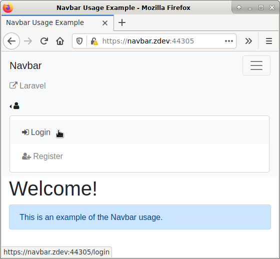
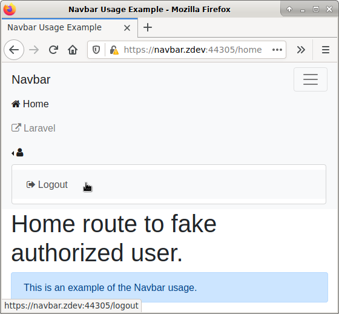

# Navbar

Render an HTML from the navigation entities, stored in a database.

## Installation

### Composer

    composer require zablose/navbar

## Usage example with Laravel

Check the [Laravel App](laravel) folder for a usage example.

Main files and folders to look at:
* [Config](laravel/config/navbar.php)
* [Migrations](laravel/database/migrations)
* [Seeders](laravel/database/seeders)
* [ComposerServiceProvider](laravel/app/Providers/ComposerServiceProvider.php)
* [NavbarComposer](laravel/app/Http/ViewComposers/NavbarComposer.php)
* [Navigation](laravel/app/Http/Navigation)

## Development

> Check submodule [readme](https://github.com/zablose/docker-images/blob/master/readme.md) for more details about
> development environment used.

### Hosts

Append to `/etc/hosts`.

```
127.0.0.25      navbar.zdev
```

## Demo

Visit [https://navbar.zdev/](https://navbar.zdev/) to play with navigation on your development environment.

### Index Page



### Home Page



## License

This package is free software distributed under the terms of the MIT license.
